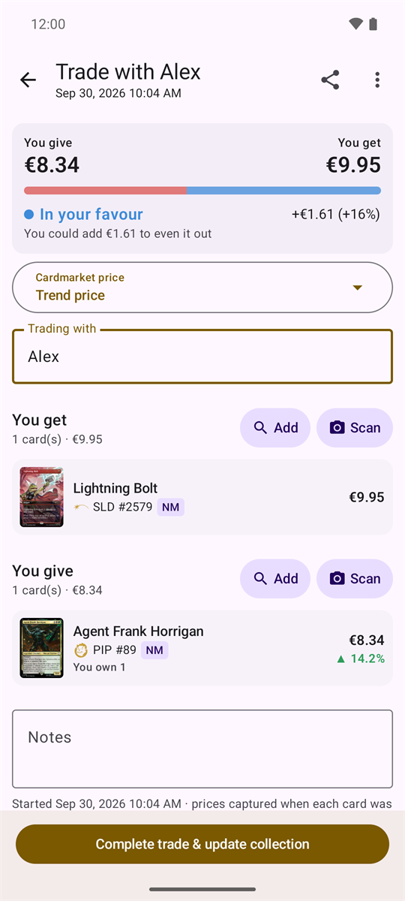
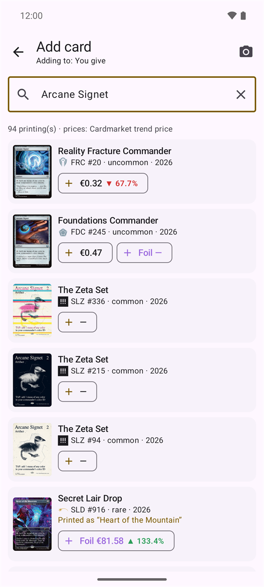
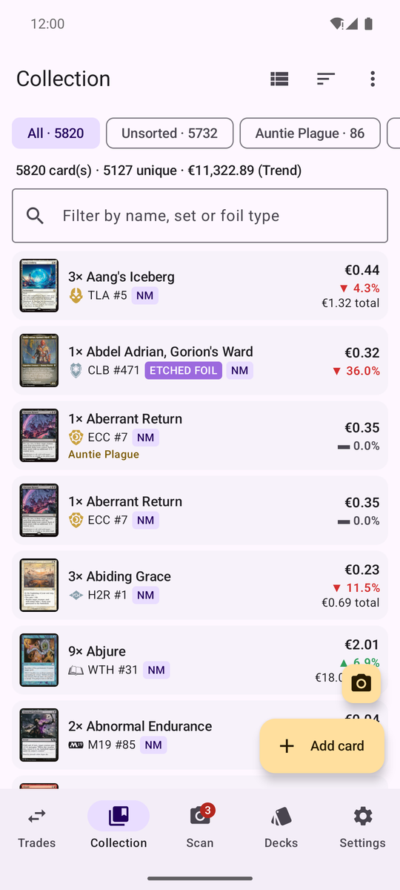
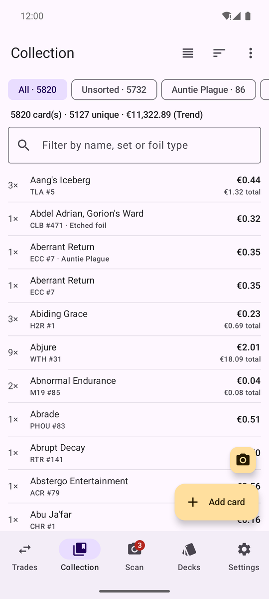
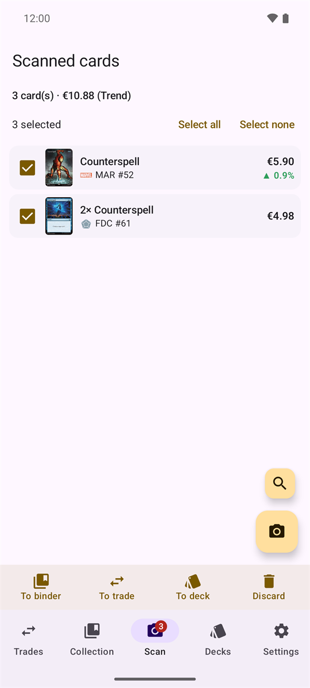
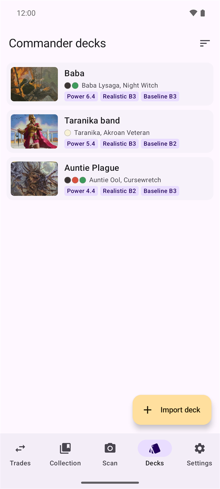
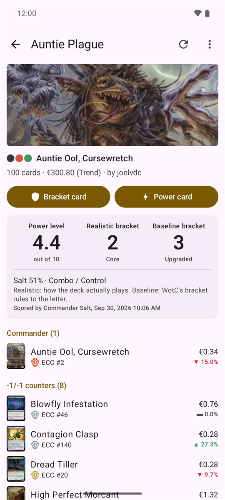
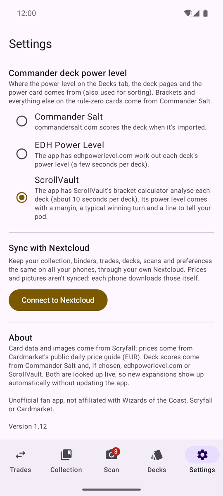
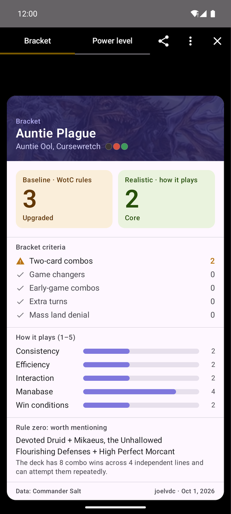
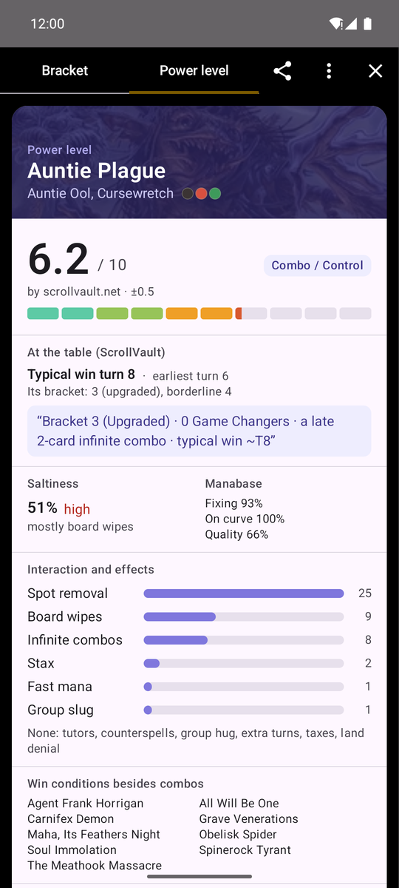

# MTG Trader (Android)

Track Magic: The Gathering trades, check they're fair using Cardmarket prices, and keep your collection up to date.
Keep your Commander decks at hand too, with their power level, brackets and rule-zero cards, organise the collection in
binders, scan piles of cards before deciding where they go, and sync it all between your phones through your own Nextcloud.

| Trade | Search | Collection | Compact view |
|:---:|:---:|:---:|:---:|
|  |  |  |  |

| Scan tab | Commander decks | Deck page | Settings |
|:---:|:---:|:---:|:---:|
|  |  |  |  |

| Bracket card | Power card |
|:---:|:---:|
|  |  |

## Install
Copy `MTG-Trader-1.20.apk` to your phone and open it (allow "install unknown apps" for your file manager/browser when asked).
It's built for 64-bit ARM phones (practically every phone from the last ~6 years). If it refuses to install, use
`MTG-Trader-1.20-universal.apk` instead (bigger, runs on any device).

## Where the data comes from (no app updates needed for new sets)
- **Cards & images:** Scryfall API, looked up live.
- **Decks:** Archidekt (decklists), Commander Salt (brackets, scores and rule-zero cards) and, if chosen, edhpowerlevel.com
  or ScrollVault (power level).
- **Prices:** Cardmarket's public daily price guide (trend, average, low, 1/7/30-day averages, normal + foil), downloaded
  automatically once a day (~26 MB) when the app opens and in the background. Settings can turn automatic updates off
  or limit them to Wi-Fi; "Update prices now" always runs.
- **Cardmarket's product list** (~20 MB, once a week): Scryfall links almost every printing to its Cardmarket product,
  but not all. With this list the app finds the missing ones itself (The List reprints such as Urza's Saga, some surge
  foils, older promos) and the separate foil products of special foils such as The Lord of the Rings' silver-foil scrolls.
- **Card details** for sorting, filters and the trade binder (colours, type, mana value and EDHREC's popularity rank):
  from Scryfall, fetched once per card (about a minute for 5,000 cards, the first time).
- **Recommendations:** [EDHREC](https://edhrec.com/) (its public card lists per commander) and
  [recommander.cards](https://recommander.cards/) (its public API, which ranks cards for a decklist).

## Commander decks
Import a public deck from **Archidekt**: paste its link in the Decks tab, share it to the app from the Archidekt app or
a browser, or pick several decks from someone's Archidekt profile (Select all / Select none); they're scored one by one in
the background. **Add to collection** (deck ⋮ menu) adds the deck's printings to a binder, optionally only the cards you
don't own yet and without basic lands. The app shows the decklist grouped by your Archidekt categories (or by card type) with Cardmarket prices, and
has [Commander Salt](https://www.commandersalt.com/) score it:
- **Power level** (out of 10), **realistic bracket** (how the deck actually plays) and **baseline bracket** (WotC's
  bracket rules to the letter), plus saltiness and archetype.
- The **bracket** and **power level rule-zero cards**, drawn by the app from Commander Salt's analysis: the brackets
  and the criteria behind them (game changers, two-card combos by name, extra turns, land denial), how the deck plays,
  saltiness, manabase, interaction counts and win conditions. They're shown full screen (screen kept on at full
  brightness) to show your table, shareable as images, and work without a connection. Commander Salt's own card
  images are still one tap away (⋮ → "Show Commander Salt's original").

**Power level source** (Settings): Commander Salt, [EDH Power Level](https://edhpowerlevel.com/) or
[ScrollVault](https://scrollvault.net/tools/commander-bracket/). The other two sites have no API, so the app opens their
calculator out of sight and reads the result (a few seconds per deck; on ScrollVault's page the ads and trackers aren't
loaded). The chosen power level is used everywhere, including the power card and sorting; brackets and everything else
stay Commander Salt's. With ScrollVault, the power level comes with its margin (e.g. 6.2 ±0.5), and the power card and
deck page add what it found "at the table": the typical and earliest winning turn from its goldfish simulation, its own
bracket call (and whether it's borderline) and its "tell your pod" line.

**Bracket-relevant cards** are tagged right in the decklist: game changers, combo pieces, extra turns and land denial
(WotC's bracket rules, in red) and tutors and fast mana (in grey), with a count above the list and **Only these cards**
to list just them. Tapping a card names its combo partners and the other decks it's in.

**Recommendations** (deck page, or the deck's ⋮ menu): cards for the deck from **EDHREC** or **recommander.cards**
(switch at the top; the choice is remembered). EDHREC's are in its own sections (New Cards, High Synergy, Top Cards, Game
Changers, Creatures, Instants…), each card with how many of the commander's decks play it and its synergy; its New Cards
section lists every recommended card first printed in the last year, not just five. recommander.cards ranks cards for
the actual decklist and shows them in its categories: Top Recommendations, New Cards, Ramp, Spot Removal, Mass Removal,
Card Advantage, Tutors, General Staples, the card types, Utility Lands and Lands (its API gives only names and scores,
so the app sorts the cards into those categories from their rules text and type). Cards already in the deck are left
out. Filter by card type, by **I own / I don't own** and by **New cards**; tap a card for its prices and to add it to the
deck (kept when the deck reloads) or to the wishlist. **Recommendations for all decks** (Decks tab ⋮ menu) asks for every
deck at once and shows the cards you already own that fit your decks, or the cards recommended for several decks.
Tap a card's picture to see it large and swipe left or right through the list, with its type, the source's numbers,
price and how many you own under each (double-faced cards can be flipped there too).
Recommendations are saved, so they show straight away and offline; ⟳ asks again.

**Cards I'm missing** (deck ⋮ menu) lists the deck's cards you don't own in any printing, with what buying them costs;
add them all to the wishlist, or share/copy them as a plain list ("1 Card name" per line) for a Cardmarket wants list.
**Cards in several decks** (Decks tab ⋮ menu) shows which cards your decks share and whether you own enough copies for
all of them.

The deck list can be sorted by name, power level, bracket (realistic, then baseline) or when the deck was last changed on
Archidekt, highest/newest first or reversed. On a deck page, **Refresh bracket and power level** scores the deck again on
Commander Salt and the chosen power level site; if the deck changed on Archidekt since it was loaded, its list is
reloaded first, so the list and the scores always belong together. **Reload decklist from Archidekt** (the ⟳ icon, or
the deck's ⋮ menu) always reloads the list and scores it again. On the Decks tab (⋮ menu), **Update all decks from
Archidekt** checks every deck and reloads and re-scores only the ones that changed, **Re-score all decks on Commander
Salt** has Commander Salt score every deck again (nothing else), and, when the power level comes from EDH Power Level
or ScrollVault, **Re-score power levels** asks that site again for every deck. Cards moved to the
Maybeboard on Archidekt leave the deck. Commander Salt has no official API: the app uses the
same calls as its website, so this part may break if the site changes. Importing a deck adds it to commandersalt.com.

## Binders
The collection can be split into binders (like ManaBox): the bar above the list shows **All**, **Unsorted** (cards in no
binder) and each binder with its card count. From the ⋮ menu you can create, rename, delete and **merge** binders (e.g.
a temporary "new cards" binder into your main one; identical cards are combined). Tap a card to move it, or some of its
copies, to another binder. Completing a trade asks which binder the received cards go into (or makes a new one); given
cards are taken from Unsorted first. CSV import/export carries a "Binder Name" column.

The collection can be shown as a **list** (default), **compact** (one text line per card) or **cards** (a grid of
big card pictures); pick it with the view button next to Sort. Prices show the value of one card, with the stack
total underneath, and "Value per card" sorts by it.

**Sort** in layers: e.g. color, then name; or type, then mana value, then name; up to three levels, each with its own
direction (A to Z / Z to A, highest / lowest first…), with shortcuts for the usual ones. Sort by name, color (W, U, B, R,
G, multicolor, colorless, lands), type, mana value, rarity, set, collector number, value per card, date added or copies.

**Filter** (the button next to Sort) for what's awkward to type: colors (has any of them, exactly these, or fits in a
color identity), type, rarity, sets (pick from the sets you own), finish, condition, language, value range and whether
the card is in one of your decks. The active filters show as chips under the search field (tap ✕ to drop one); the
search field still finds cards by name, set or foil type.

Tap a card to add **notes** (condition details, where it came from) and the **purchase price** per copy; the card then
shows what you paid against what it's worth now. Both go into the CSV export and are read back on import. The card
also lists the decks it's in.

Tap a card's picture (in its card window, search, decks, the scanner…) to see it full screen; pinch or double-tap to
zoom. Double-faced cards (modal double-faced cards like Bala Ged Recovery, transform cards) get a **Flip** button to see
the back.

**Collection value over time:** tap the total above the list (or ⋮ → Collection value over time). The app saves the
collection's value once a day, so the chart fills in as days go by (1 month, 3 months, 1 year, all); underneath are the
cards whose price is rising or falling most lately, over all the copies you own; tap one to open it.

## Trade binder
⋮ → **Make a trade binder** suggests what to put in a "Trade binder": only spare copies (what your decks use stays home,
and wishlist cards and basic lands are left out), ranked by value and by how much Commander players want them (EDHREC's
popularity rank), with a nudge for rising prices. Set the most cards it may hold, the minimum value (any value, €0.50,
€1, … or your own) and whether to keep at least one copy of each card. **Keep the best copy for my decks** (on by
default) offers the cheaper spare copies of cards your decks use, so the most valuable or fanciest one stays with the
deck; **…of every card** does the same for all cards. **Swap** on a suggestion lists your other copies of the card
(printing, finish, condition, language, and where they are) to put in the binder instead; the app remembers your pick.
Tap a suggestion to open the card. Later, **Update trade binder** (⋮ menu, or the button in the binder) shows what to put in
and what to take out (a deck uses the card now, it dropped below the minimum value, better cards pushed it out…) with
the reason for each; untick what you don't want, then apply. Unticked suggestions aren't made again (⋮ to undo that).
Copies are taken from Unsorted and other binders before binders named after a deck, and cards taken out go back to the
binder holding their other copies. Nothing changes until you apply.

## Wishlist
The **★ Wishlist** in the binder bar holds the cards you want. Add them with "Add card" or the scanner while it's
selected, or from a deck's "Cards I'm missing". By default any printing will do; it can be limited to one printing and
finish. Each card shows whether you own it, and "Remove the cards I got since adding them" (⋮ menu) clears what you've
acquired since (copies you already owned when you added it don't count). Cards on the wishlist get a ★ when they're on
the "You get" side of a trade. The wishlist isn't part of the collection's value, can be shared as a list and is synced.

## Appearance
Settings → **Appearance**: same as the phone, light or dark.

## Scan tab
Scan a pile of cards (or add them by name) into a waiting list, then select some or all of them and send them **to a
binder**, **to a trade**, **to a deck** (added in the app only, kept when the deck is refreshed) or **discard** them.

While scanning, the cards added show up in a list under the camera with their price (the price type chosen in
Settings). When only the name was readable, the app guesses the printing and says **Choose printing**: tap the card
to pick the right set from all its printings, with pictures and prices, without leaving the scanner. Normal / Foil /
Etched at the top of that list sets the finish (also without changing the printing); printings that only exist in
another finish say so, e.g. "Surge foil only".

Cards from before 2015 have no set code printed, so for those the scanner also looks at the **set symbol** at the end of
the type line and compares it with the symbols of every set the card was printed in. When one clearly matches, it picks
that printing ("Set recognised by its symbol · tap if wrong"); when it isn't sure (some symbols are nearly identical,
like M11 and M12) it leaves the choice to you as before.

**Language:** the chip under the camera reads "auto" (the language printed on the card, else English) or a language you
choose for all scanned cards; the choice is kept for the next scans. A chosen language also lets a foreign card be
identified by its set code and number alone.

## Sync between phones
Settings → **Sync with Nextcloud** keeps the collection, binders, wishlist, trades, decks, scans and preferences the same on all
your phones, using a file (`sync.json.gz`) in a folder of your own [Nextcloud](https://nextcloud.com/). Prices and
pictures aren't synced; each phone downloads those itself.
- **Connect:** enter your server address and log in in the browser; the app gets its own app password, which you can
  revoke in Nextcloud (Settings → Security). An app password made by hand works too. Disconnecting removes the app's
  app password and leaves your data where it is.
- **Folder:** after logging in you pick the folder for the sync file: browse your Nextcloud folders, make a new one,
  or keep the usual "MTG Trader". Pick the same folder on every phone; the picker says when a folder already holds MTG
  Trader data. Settings → Folder → **Change** moves syncing to another folder (the old file stays where it was).
- **First sync:** if both the phone and Nextcloud already hold data, you choose: merge both, use the Nextcloud copy, or
  start from this phone.
- **After that** changes are merged item by item: the most recent change to a card stack, binder, trade, deck or scan
  wins, and deletions carry over. For a deck, the list always comes from the phone that loaded the newer version from
  Archidekt, so an old list can't come back because the other phone scored or rated its copy later. With **Sync automatically** on, it syncs when you open the app, about 30 seconds
  after a change, when you leave the app and every hour; **Only on Wi-Fi** keeps automatic syncs off mobile data.
  "Sync now" always works.

The password is stored encrypted with a key kept in the phone's keystore.

## Rebuilding
Requires JDK 17+ and the Android SDK (installed at `%USERPROFILE%\Android\sdk`, see `local.properties`).
```
set JAVA_HOME=C:\Program Files\Java\jdk-18.0.2
gradlew assembleRelease
```
APKs land in `%LOCALAPPDATA%\mtgtrader-build\app\outputs\apk\release\` (kept out of OneDrive on purpose).

**Keep `keystore/` and `keystore.properties` safe and private.** Android only installs an update over the existing app
if it is signed with the same key; losing it means uninstalling (and losing app data) to install a new version.

Tests: `gradlew testDebugUnitTest` (logic, including the sync merge) and `gradlew connectedDebugAndroidTest` (OCR scanner pipeline, needs a device/emulator).

## License and disclaimer
The code is released under the [MIT License](LICENSE). That covers this app's code only, not the card data, names or
images it shows.

MTG Trader is unofficial Fan Content permitted under the Fan Content Policy. Not approved/endorsed by Wizards. Portions
of the materials used are property of Wizards of the Coast. ©Wizards of the Coast LLC.

The app isn't affiliated with or endorsed by Scryfall, Cardmarket, Archidekt, Commander Salt, EDH Power Level or ScrollVault; it uses their public
data. Commander Salt has no official API: the app makes the same requests as its website, so that part may stop working
if the site changes. Prices are for guidance only.
